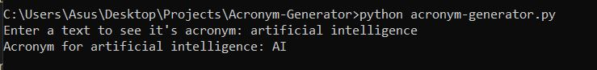
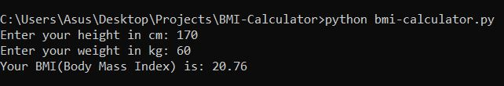
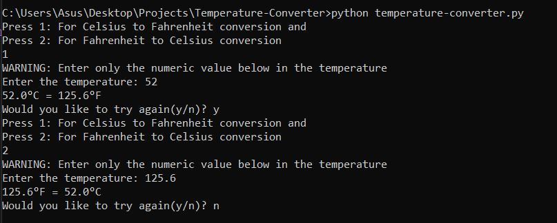
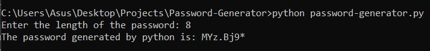

# Python-Projects
This repo contains some beginner friendly Python Projects. 
## Acronym Generator
An acronym is a word or name formed from the initial components of a longer name or phrase, usually using individual initial letters. This project aims to generate an Acronym for any user given input.
#### Output 

## BMI Calculator
Body mass index (BMI) is a measure of body fat based on height and weight that applies to adult men and women. This project aims to calculate the BMI of a user. Following is the formula to calculate BMI:  

#### Output 

## Temperature Converter
This project aims to convert the temperature from celsius to fahrenheit and from fahrenheit to celsius.
#### Output 

## Password Generator
This project aims to generate a random password of user input length using the [**`secrets`**](https://docs.python.org/3/library/secrets.html) and `string` module. The reason I've used `secrets` module is that it increases the security. 
#### Output 

## Dice Simulator
This is considered as the most basic project in python. I have used the `time` and `random` module in this project. Basically, [this](Dice-Simulator) project is all about generating a random number in the range of 1 to 6 for some number of times(attempts) and lastly displaying the total score with the attempts.    
#### Output 

## Dice Game
This project uses the concept of [Dice Simulator](Dice-Simulator/dice_simulator.py). [This](Dice-Game) game supports multi-players and multi-rounds.    
#### Output 

## Word Cloud Generator
Word Cloud is a data visualization technique used for representing text data in which the size of each word indicates its frequency or importance. Significant textual data points can be highlighted using a word cloud. Word clouds are widely used for analyzing data from social network websites. We'll be using `pandas`, `wordcloud` and `matplotlib` modules of Python.  
- `pandas` to read data file which includes words for generating word cloud.
- `matplotlib` to plot word cloud figure.
- `wordcloud` to generate wordcloud.
#### Output 

