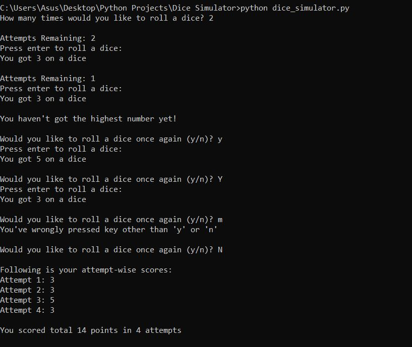

# Python-Projects
This repo contains some beginner friendly Python Projects
## Dice Simulator
This is considered as the most basic project in python. I have used the `time` and `random` module in this project. Basically, [this](Dice-Simulator) project is all about generating a random number in the range of 1 to 6 for some number of times(attempts) and lastly displaying the total score with the attempts.    
###### Output 

## Dice Game
This project uses the concept of [Dice Simulator](Dice-Simulator/dice_simulator.py). [This](Dice-Game) game supports multi-players and multi-rounds.    
##### Output 

